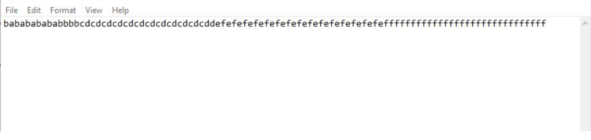
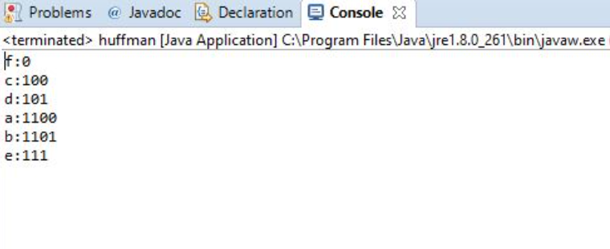

# Given a text file, how to reduce the amount of space required to store it?

The frequency of Individual letters is used to encode each character into 0's and 1's (unique codes) such that it reduces space.
Letter which occurs most frequently has the smaleest prefix code. Prefix code is such that none of the codes is the prefix of another code. 
This is done for the ease of decoding. 
In this repository, only encoding is implemented. 
### NOTE : 
The code was implemented assuming that the characters are only lowercase english alphabets but it can be extended for other types of characters too.

## INPUT FILE

## OUTPUT (PREFIX CODES GENERATED)
 
#### As you can see that f is the most frequent character so it is assigned the shortest prefix code.
